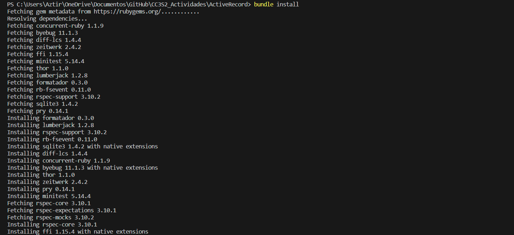
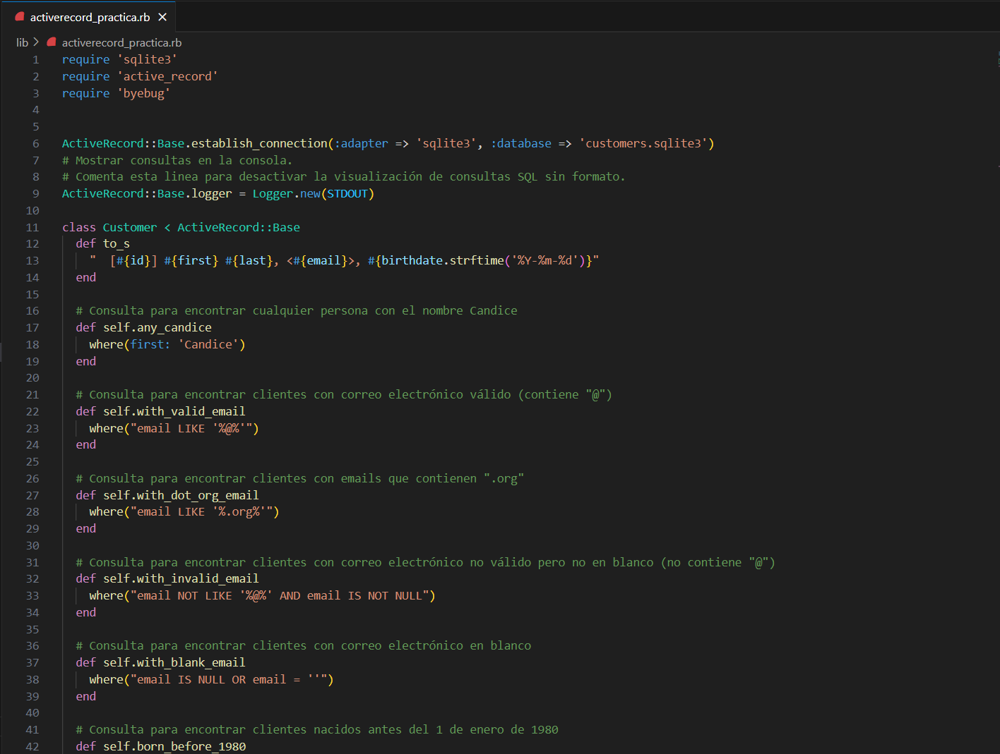

# ActiveRecord

## **Preparación del proyecto**

 **Ejecutamos `bundle install`**

Dentro del directorio del proyecto, ejecutamos el siguiente comando para instalar las gemas necesarias:

```ruby
bundle install
```

Se instalaron correctamente las gemas



## **Configuración de la base de datos**

Verificamos que teníamos la base de datos **`customer.sqlite3`** en el directorio del proyecto.


En caso de que no la tuviéramos, restauramos la copia de seguridad **`customers-original.sqlite3`**.

También verificamos que el archivo **`customers.csv`** estuviera presente.


## **Ejecución de las pruebas iniciales**

Utilizamos el siguiente comando para ejecutar las pruebas automatizadas con RSpec:

```ruby
bundle exec rspec spec/activerecord_practica_spec.rb
```

Observamos los resultados de las pruebas en la terminal. Deberíamos ver 13 ejemplos, 0 fallas y 13 pendientes.


## Proceso de desarrollo y pruebas

Escogemos un ejemplo para trabajar en orden, comenzando con el primero, es decir decidimos trabajar en el caso de prueba 'cualquier persona con el nombre Candice', nos enfocaremos en esta tarea específica.


Cambiamos **`xspecify`** por **`specify`** en el caso de prueba que elegimos. 


Esto hará que esa prueba en particular no se omita en la siguiente ejecución de prueba, más bien salio error 


Abrimos el archivo **`lib/activerecord_practica.rb`** y completamos el cuerpo del método de clase **`Customer.any_candice`** según las instrucciones del caso de prueba.


Guardamos el archivo **`activerecord_practica.rb`** después de escribir y completar el código.

Abrimos otra terminal y ejecutamos **`guard`**. Esto permite que las pruebas se vuelvan a ejecutar automáticamente cada vez que hacemos cambios en los archivos de código.

 

Cuando hemos completado el código correctamente y la prueba pasa, el nombre de la prueba se imprimirá en verde, y todas las demás pruebas seguirán pendientes.

 


Continuamos este proceso para cada caso de prueba, completando las consultas de ActiveRecord según las instrucciones de cada uno.




Continuamos trabajando en cada caso de prueba hasta que todas las pruebas hayan pasado con éxito. Deberíamos ver el nombre de cada ejemplo pasado en verde.

