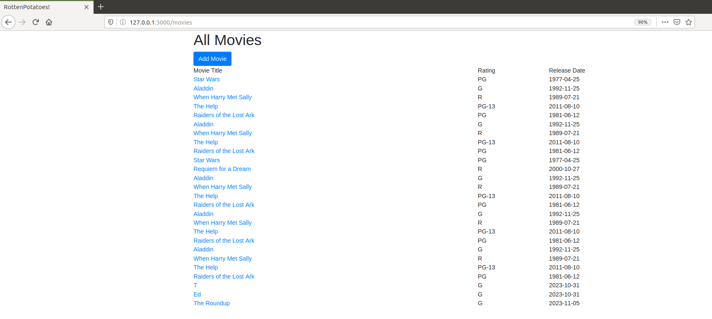

## AJAX: Asynchronous JavaScript y XML

Indicamos los pasos necesarios para la programación `AJAX on Rails`: 

1. Crear una acción del controlador o modificar una existente para gestionar las peticiones AJAX hechas por el código JavaScript.
   En lugar de procesar una vista completa, la acción procesará una parcial para generar un fragmento HTML que se insertará en la página. 

2. Construir un URI REST en JavaScript y utilizar XHR (XmlHttpRequest) para enviar la petición HTTP al servidor.
   Como habrás supuesto, jQuery dispone de atajos útiles para muchos casos habituales, por lo que utilizaremos las funciones de más alto nivel y más potentes que ofrece jQuery en      lugar de llamar a XHR directamente. 

3. Dado que JavaScript, por definición, se ejecuta en un hilo único (single-threaded ), sólo puede trabajar en una tarea cada vez hasta que dicha tarea se completa, la interfaz de
   usuario del navegador se quedaría `congelada` mientras JavaScript esperara la respuesta del servidor. Por ello, XHR en cambio vuelve inmediatamente de la llamada a la función y
   permite proporcionar una función callback para manejar el evento que se activará cuando responda el servidor o si se produce un error. 

4. Cuando la respuesta llega al navegador, el contenido de la respuesta se pasa a la función callback. Puede utilizar la función `replaceWith()` de jQuery para reemplazar un       
   elemento existente por completo, `text()` o `html()` para actualizar el contenido de un elemento in situ o una animación como `hide()` para ocultar o mostrar elementos.
   Puesto que las funciones JavaScript son clausuras (como los bloques de Ruby), la función `callback` tiene acceso a todas las variables visibles en el momento en el que se
   realizó la llamada XHR, aun cuando se ejecuta más tarde y en un entorno distinto.


### Parte 0

Antes de comenzar con las modificaciones correspondientes para poder realizar la actividad, nos encontramos con unos pequeños errores, el primero en los controladores ya que la variable Moviegoers no esta inicializada en ese caso debemos cambiar esa linea de codigo por la variable Movie, luego nos muestra un error sobre sintaxis en el archivo de `movie.rb` ya que habia un segmento de codigo comentado, una vez resuelto estos errores ejecutamos nuestro servidor en rails, el cual tiene la siguiente vista:



Pero al tratar de editar una película, nos dice que estamos intentando acceder a la acción de edición (edit) en el controlador MoviesController, pero Rails no puede encontrar la plantilla adecuada para mostrar en el formato text/html. Por eso, agregamos la vista llamada edit.html.erb, pero al actualizar la información de la película, nos aparece un error.


### Parte 1

El paso 1 necesita que identifiquemos o creemos una nueva acción de controlador que será la encargada de gestionar la petición. Usaremos la acción ya existente `MoviesController#show`, por lo que no necesitaremos definir una nueva ruta. \

Primero identificaremos el elemento que se va a renderizar, como nos menciona la actividad modificaremos el metodo `show`, para que de este modo si se recibe una petición AJAX, entonces procesará la sencilla vista parcial en lugar de la vista completa.


Para ello, agregaremos la siguiente linea, la cual es la encargada como ya mencionamos de renderizar una vista parcial de la vista `movie`, de este modo podra recibir peticiones normales como peticiones AJAX.

```
render(:partial => 'movie', :object => @movie) if request.xhr?
```


Además, debemos crear un archivo de vista parcial llamado _movie.html.erb para definir la presentación específica de una película cuando se realiza una solicitud AJAX en la acción `show` del controlador `MoviesController`. Este archivo estará ubicado en el directorio app/views/movies de nuestro proyecto y contendrá lo siguiente:

```html
<p> <%= movie.description %> </p>
<%= link_to 'Edit Movie', edit_movie_path(movie), :class => 'btn btn-primary' %>
<%= link_to 'Close', '', :id => 'closeLink', :class => 'btn btn-secondary' %>
```


Reiterando, este archivo define cómo se mostrará la información de la película en el contexto de una solicitud AJAX.

**¿Cómo sabe la acción de controlador si show fue llamada desde código JavaScript o mediante una petición HTTP normal iniciada por el usuario?**
La acción del controlador `show` determina si fue llamada desde código JavaScript o mediante una petición HTTP normal iniciada por el usuario a través de la verificación de `request.xhr?`. La condición `if request.xhr?` verifica si la solicitud se realizó a través de XMLHttpRequest, comúnmente asociado con peticiones AJAX. 

### Parte 2

 **¿Cómo debería construir y lanzar la petición XHR el código JavaScript?**     
 
  Queremos que la ventana flotante aparezca cuando pinchamos en el enlace que tiene el nombre de la película.

Explica el siguiente código

```
var MoviePopup = {
  setup: function() {
    // add hidden 'div' to end of page to display popup:
    let popupDiv = $('<div id="movieInfo"></div>');
    popupDiv.hide().appendTo($('body'));
    $(document).on('click', '#movies a', MoviePopup.getMovieInfo);
  }
  ,getMovieInfo: function() {
    $.ajax({type: 'GET',
            url: $(this).attr('href'),
            timeout: 5000,
            success: MoviePopup.showMovieInfo,
            error: function(xhrObj, textStatus, exception) { alert('Error!'); }
            // 'success' and 'error' functions will be passed 3 args
           });
    return(false);
  }
  ,showMovieInfo: function(data, requestStatus, xhrObject) {
    // center a floater 1/2 as wide and 1/4 as tall as screen
    let oneFourth = Math.ceil($(window).width() / 4);
    $('#movieInfo').
      css({'left': oneFourth,  'width': 2*oneFourth, 'top': 250}).
      html(data).
      show();
    // make the Close link in the hidden element work
    $('#closeLink').click(MoviePopup.hideMovieInfo);
    return(false);  // prevent default link action
  }
  ,hideMovieInfo: function() {
    $('#movieInfo').hide();
    return(false);
  }
};
$(MoviePopup.setup);
```

Ocurren algunos trucos interesantes de CSS en el código anterior Puesto que el objetivo es que la ventana emergente `flote`, podemos utilizar CSS para especificar la posición como absolute añadiendo el siguiente código en `app/assets/stylesheets/application.css` :

```
#movieInfo {
  padding: 2ex;
  position: absolute;
  border: 2px double grey;
  background: wheat;
}
```

¿Cuáles son tus resultados?

### Parte 3

Conviene mencionar una advertencia a considerar cuando se usa JavaScript para crear nuevos elementos dinámicamente en tiempo de ejecución, aunque no surgió en este ejemplo en concreto. Sabemos que `$(’.myClass’).on(’click’,func)` registra `func` como el manejador de eventos de clic para todos los elementos actuales que coincidan con la clase CSS myClass. Pero si se utiliza JavaScript para crear nuevos elementos que coincidan con `myClass` después de la carga inicial de la página y de la llamada inicial a `on`, dichos elementos no tendrán el manejador asociado, ya que `on` sólo puede asociar manejadores a elementos existentes. 

¿Cuál es solución que brinda jQuery  a este problema? 