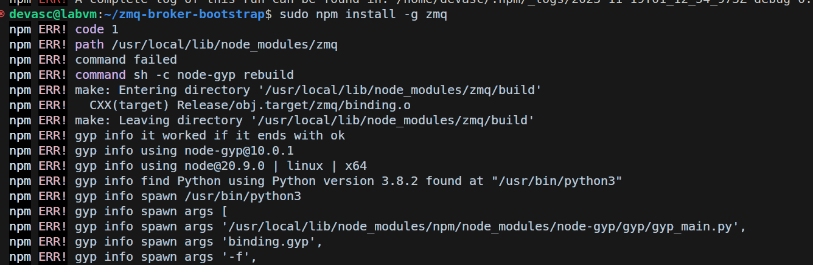

# Código limpio y el arte del manejo de excepciones

En el link proporcionado, el  artículo en cuestión aborda el tema de manejo de excepciones en programación, centrándose en prácticas recomendadas para mejorar la legibilidad, mantenibilidad y calidad del código. 

A continuación se detallara un ejemplo siguiendo las pautas dadas en este tutorial.

## Paso 1: Creamos un Proyecto

Creamos un nuevo directorio para nuestro proyecto en un lugar conveniente del sistema de archivos. Por ejemplo:


```
mkdir gestion_excepciones
cd gestion_excepciones
``` 

## Paso 2: Creamos Excepciones Personalizadas
2.1. Dentro del directorio del proyecto, creamos un subdirectorio llamado lib para almacenar nuestros archivos de código fuente:

```
mkdir lib
```
2.2. Creamos un archivo llamado application_error.rb dentro del directorio lib:

touch lib/application_error.rb

2.3. Abrimos application_error.rb en nuestro editor de texto y definimos las excepciones personalizadas:

```ruby
# lib/application_error.rb
class ApplicationError < StandardError; end

class ValidationError < ApplicationError; end
class RequiredFieldError < ValidationError; end
class UniqueFieldError < ValidationError; end

class ResponseError < ApplicationError; end
class BadRequestError < ResponseError; end
class UnauthorizedError < ResponseError; end
```

## Paso 3: Creamos el Manejo de Excepciones

3.1. En el directorio lib, creamos un archivo llamado exception_handler.rb:

```
touch lib/exception_handler.rb
```
3.2. Abrimos exception_handler.rb en nuestro editor de texto y definimos el manejo de excepciones:
```ruby
# lib/exception_handler.rb
module ExceptionHandler
  def self.handle(exception)
    case exception
    when ValidationError
      handle_validation_error(exception)
    when ResponseError
      handle_response_error(exception)
    else
      log_unhandled_exception(exception)
    end
  end

  def self.handle_validation_error(exception)
    puts "Handling Validation Error: #{exception.message}"
    # Lógica adicional para manejar errores de validación
  end

  def self.handle_response_error(exception)
    puts "Handling Response Error: #{exception.message}"
    # Lógica adicional para manejar errores de respuesta
  end

  def self.log_unhandled_exception(exception)
    puts "Logging Unhandled Exception: #{exception.message}"
    # Lógica para registrar excepciones no manejadas
  end
end
```
## Paso 4: Creamos el Registro de Errores

4.1. En el directorio lib, creamos un archivo llamado logger.rb:

```
touch lib/logger.rb
```

## Paso 5: Usamos en la Aplicación

5.1. En el directorio principal del proyecto, creamos un archivo llamado main.rb:
```
touch main.rb
```

5.2. Abrimos main.rb en nuestro editor de texto y utilizamos las clases y módulos definidos:

```ruby
# main.rb
$LOAD_PATH << File.expand_path('lib', __dir__)

require 'application_error'
require 'exception_handler'
require 'logger'

include ExceptionHandler

begin
  # Código que puede generar excepciones
  raise ValidationError, 'Campo requerido no presente'
rescue ApplicationError => e
  ExceptionHandler.handle(e)
end
```
## Paso 6: Ejecutamos el Programa

6.1. Ejecutamos el programa main.rb:

```
ruby main.rb
```

6.3. Observamos la salida en la consola y verificamos que el manejo de excepciones se realiza correctamente.


¡Listo! Hemos replicado el tutorial y creado un simple sistema de gestión de excepciones en Ruby. Podemos expandir y personalizar este proyecto según nuestras necesidades.

**¿Que diferencias encuentras con lo indicado aquí https://codedamn.com/news/javascript/error-handling-debugging para Java Script?**

Este artículo proporciona una guía detallada sobre las técnicas de manejo de errores y depuración en JavaScript, con un enfoque en las mejores prácticas, llamaremos a este Articulo 1 y Articulo 2 al manejo de excepciones en Ruby, por tanto a continuación detallaremos las diferencias que hemos podido encontrar:

Ambos artículos abordan aspectos relacionados con el manejo de errores, pero se centran en lenguajes de programación diferentes (JavaScript en el primer artículo y Ruby en el segundo). Aquí hay algunas diferencias y similitudes notables entre los dos:

**Lenguaje de Programación:**

El artículo 1 se centra en JavaScript, mientras que el artículo 2 se centra en Ruby. Cada lenguaje tiene sus propias particularidades en cuanto a cómo se manejan las excepciones y errores, y los enfoques específicos pueden variar.

**Enfoque en Jerarquía de Excepciones:**

El artículo 2 destaca la importancia de crear una jerarquía de excepciones personalizada, una práctica específica de la programación orientada a objetos. El artículo 1 no profundiza específicamente en este aspecto.

**Convenciones de Nomenclatura:**

El artículo 2 menciona la importancia de seguir convenciones de nomenclatura, como el uso del signo de exclamación (!). Esto es específico de las convenciones de Ruby. El artículo 1 no se centra en convenciones de nomenclatura específicas.

**Manejo de Excepciones en JavaScript:**

El artículo 1 se centra en el manejo de errores en JavaScript, utilizando construcciones de try-catch y discutiendo diversas estrategias para identificar y gestionar errores.

**Enfoque en el Registro de Excepciones:**

El artículo 2 resalta la importancia de registrar excepciones para facilitar la depuración. Aunque el artículo 1 también destaca la importancia de la depuración, no se centra específicamente en el registro de excepciones.


# Cómo configurar una arquitectura de microservicios en Ruby

La guía explora la implementación de microservicios, destacando una arquitectura de corredor. Los microservicios ofrecen flexibilidad y mantenimiento simplificado al reemplazar los back-ends monolíticos. La arquitectura de corredor, con servicios conectados a un intermediario, se utiliza para la comunicación. ZeroMQ se emplea para la mensajería entre servicios y corredor. Se describen los pasos iniciales, incluyendo la instalación de Node.js, ZeroMQ y Git, seguidos por la ejecución del corredor. Aunque la arquitectura de corredor tiene desafíos, se mencionan estrategias de mitigación, como la ejecución de múltiples instancias del intermediario. El artículo concluye con la configuración inicial de un servicio y pruebas de comunicación entre servicios en la arquitectura de microservicios.


## Paso 1: Configuración de Herramientas

Asegurémonos de tener todas las herramientas necesarias instaladas en nuestra máquina: Node.js, ZeroMQ y Git.


Se puede observar si contamos con las herramientas en nuestra maquina.

## Paso 2: Configuración del Corredor:

Después de instalar las dependencias, procedemos a configurar y ejecutar el corredor.

- Clonamos el programa de arranque del Broker desde GitHub:

```bash
$ git clone git@github.com:dadah/zmq-broker-bootstrap.git
```


- Accedemos al directorio creado e instalamos las dependencias del paquete:

```bash
$ cd zmq-broker-bootstrap
$ npm install
```

En la siguiente imagen podemos observar que si tenemos npm con la version 10.2.3


Pero al momento de escribir el comando, encontramos el siguiente errror: 


Una de las posibles causas puede ser problemas un problema durante el proceso de compilación de zmq, para ello optamos por las siguientes opciones para poder resolver el problema: 

* Asegurar la compatibilidad de versiones entre Node.js y npm, haremos esto con el siguiente comando 

  

* Intentaremos reconstruir el modulo zmq manualmente: 


* Intentaremos instalar globalmente el paquete zmq

  

  Observamos que tenemos nuevamente problemas al querer instalar npm


  ```bash
  $ bin/zss-broker run
  ```

Puede encontrar archivos de configuración para cada entorno en el  `config/`. Esta es la configuración de desarrollo predeterminada:  


 Define los parámetros de configuración básicos para un broker que utiliza el protocolo ZMQ para la comunicación. Especifica los puntos finales para las conexiones de clientes y las apariciones de servicios, así como parámetros para la gestión de la disponibilidad y la conectividad de los servicios.

## Paso 3: Configuración y Ejecución del Servicio:

Con el corredor en marcha, procedemos a configurar y ejecutar nuestro primer microservicio Ruby.

- Clonamos el repositorio de arranque del servicio desde GitHub:

  ```bash
  $ git clone git@github.com:dadah/zmq-service-suite-ruby-bootstrap.git
  ```

  

- Accedemos al directorio creado e instalamos todas las dependencias:

  ```bash
  $ cd zmq-service-suite-ruby-bootstrap
  $ bundle install
  ```

  

  Cabe recalcar que hubo muchos errores debido a que se estaban usando versiones muy precarias de las gemas, esto debe ser porque es un proyecto antiguo y las gemas por eso estaban desactualizadas para la version de ruby que estabamos usado, a continuación se presenta los problemas que se presento por las versiones de gemas, pero pudo resolverse tal como se observa en la imagen anterior.

  


- Iniciamos el servicio:

  ```bash
  $ bin/zss-service run
  ```
  Es decir, tendremos que ejecutar el siguiente codigo del directorio proporcionado:

   

  Vemos que tenemos problemas con BigDecimal

  
  
 
## 4. Verificación del Corredor y Mensajes del Servicio:**

Debido al problema anterior, no tuvimos el servicio en funcionamiento, la salida esperada en caso el servicio hubiese funcionado seria la siguiente:
 ```
 2015-12-15 16:45:05 | INFO | BROKER - Async Broker is waiting for messages...

2015-12-15 16:45:14 | DEBUG | BACKEND - received from: hello-word#aaa65374-8585-410a-a41d-c8a5b024553b rid: 76f50741-913a-43b9-94b0-36d8f7bd75b1
2015-12-15 16:45:14 | DEBUG | BACKEND - routing from: hello-word#aaa65374-8585-410a-a41d-c8a5b024553b rid: 76f50741-913a-43b9-94b0-36d8f7bd75b1 to SMI.UP request...
2015-12-15 16:45:14 | INFO | SMI - SMI register for sid: HELLO-WORD instance: hello-word#aaa65374-8585-410a-a41d-c8a5b024553b!
2015-12-15 16:45:14 | DEBUG | BACKEND - reply to: hello-word#aaa65374-8585-410a-a41d-c8a5b024553b rid: 76f50741-913a-43b9-94b0-36d8f7bd75b1 with status: 200
2015-12-15 16:45:15 | DEBUG | BACKEND - received from: hello-word#aaa65374-8585-410a-a41d-c8a5b024553b rid: 3b3a0416-73fa-4fd2-9306-dad18bc0502a
2015-12-15 16:45:15 | DEBUG | BACKEND - routing from: hello-word#aaa65374-8585-410a-a41d-c8a5b024553b rid: 3b3a0416-73fa-4fd2-9306-dad18bc0502a to SMI.HEARTBEAT request...
2015-12-15 16:45:15 | DEBUG | BACKEND - reply to: hello-word#aaa65374-8585-410a-a41d-c8a5b024553b rid: 3b3a0416-73fa-4fd2-9306-dad18bc0502a with status: 200
2015-12-15 16:45:16 | DEBUG | BACKEND - received from: hello-word#aaa65374-8585-410a-a41d-c8a5b024553b rid: b3044c24-c823-4394-8204-1e872f30e909
2015-12-15 16:45:16 | DEBUG | BACKEND - routing from: hello-word#aaa65374-8585-410a-a41d-c8a5b024553b rid: b3044c24-c823-4394-8204-1e872f30e909 to SMI.HEARTBEAT request...
2015-12-15 16:45:16 | DEBUG | BACKEND - reply to: hello-word#aaa65374-8585-410a-a41d-c8a5b024553b rid: b3044c24-c823-4394-8204-1e872f30e909 with status: 200
 ```

## 5. Consumiendo Nuestro Servicio: 

Ahora que tenemos nuestro servicio "Persona" en ejecución, veamos cómo lo consumimos. En el repositorio de arranque, contamos con un cliente ficticio que podemos utilizar para probar nuestro servicio "Hello World". Abramos una nueva ventana o pestaña de la consola y vayamos al directorio de servicios. Una vez allí, ejecutemos el siguiente comando:

```bash
$ bin/zss-client
```

Deberíamos ver algo como esto:

```bash
15-49-15 16:49:54 | INFO | ZSS::CLIENT - Request 90a88081-3485-45b6-91b3-b0609d64592a enviado a HELLO-WORD:*#HELLO/WORLD con un tiempo de espera de 1.0 segundos
15-49-15 16:49:54 | INFO | ZSS::CLIENT - Recibida respuesta a 90a88081-3485-45b6-91b3-b0609d64592a con estado 200
"Hello World"
```

Si vamos a la ventana de la consola donde se está ejecutando nuestro servicio, deberíamos ver algo como esto:

```bash
Started hello-word daemon...
15-45-15 16:45:14 | INFO | ZSS::SERVICE - Iniciando SID: 'HELLO-WORD' ID: 'hello-word#aaa65374-8585-410a-a41d-c8a5b024553b' Env: 'development' Broker: 'tcp://127.0.0.1:7776'
15-49-15 16:49:54 | INFO | ZSS::SERVICE - Manejando solicitud para HELLO-WORD:*#HELLO/WORLD
15-49-15 16:49:54 | INFO | ZSS::SERVICE - Respuesta con estado: 200
```

Perfecto. Acabamos de lanzar y consumir nuestro microservicio "Hello World". Sin embargo, esto no es lo que nos propusimos hacer. Queremos construir nuestro(s) servicio(s). Así que, vamos a ello.

**6. Construyendo Nuestro Servicio:**

Primero, detengamos nuestro servicio "Hola Mundo". Vayamos a la ventana de la consola del servicio y presionemos `Ctrl+C` para detener el servicio.

Ahora, convertiremos nuestro servicio "Hola Mundo" en el servicio "Persona".

**Estructura del Código:**

Echemos un vistazo al árbol de código de nuestro proyecto. La jerarquía de archivos/carpetas de nuestro proyecto `zmq-service-suite-ruby-bootstrap` se ve así:

- `bin`: Directorio donde almacenamos los scripts que inician nuestro servicio.
- `config`: Directorio que almacena todos los archivos de configuración.
- `lib`: Directorio donde reside el código de nuestra aplicación principal.
  - `daos`: Almacena nuestros objetos ActiveModel si estamos utilizando ActiveRecord, o cualquier otro objeto de acceso a datos que podamos crear eventualmente.
  - `dtos`: Almacena nuestros objetos de transferencia de datos (DTO). Estos objetos son los que finalmente se envían de vuelta a los clientes del servicio.
  - `repositories`: Almacena nuestros repositorios. Los repositorios son objetos que permiten a los servicios acceder a datos y son los únicos objetos autorizados para manejar DAO.
  - `repositories/mappers`: Almacena nuestros mapeadores. Los mapeadores son objetos que convierten DAO en DTO y viceversa.
- `config/application.yml`: Almacena las configuraciones de nuestra aplicación.
- Otros archivos y directorios que proporcionan configuraciones y scripts de inicialización.

**Servicio “Persona”:**

Sigamos con nuestro servicio “Persona”. Comencemos configurando la conexión de la base de datos. Abre el archivo `config/initializers/active_record.rb` y descomenta la única línea allí. Luego, agrega la siguiente entrada a tu configuración de desarrollo para `application.yml`:

```yaml
defaults: &defaults
  broker:
    backend: tcp://127.0.0.1:7776
    frontend: tcp://127.0.0.1:7777
  logging:
    console:
      level: info
  database:
    adapter: postgresql
    database: zss-tutorial-development
```

Ahora, crea la migración ejecutando:

```bash
$ rake db:create
$ rake db:migrate
```

Crea el modelo para la persona en `lib/daos/person.rb`:

```ruby
module DAO
  class Person < ActiveRecord::Base
  end
end
```

Crea el DTO para la persona en `lib/dtos/person.rb`:

```ruby
module DTO
  class Person < Base
    attr_reader :id, :name
  end
end
```

Crea el mapeador en `lib/repositories/mappers/person.rb`:

```ruby
module Mapper
  class Person < Mapper::Base
    def self.to_dao(dto_instance)
      DAO::Person.new(id: dto_instance.id, name: dto_instance.name)
    end

    def self.to_dto(dao_instance)
      DTO::Person.new(id: dao_instance.id, name: dao_instance.name)
    end
  end
end
```

Crea el repositorio en `lib/repositories/person.rb`:

```ruby
module Repository
  class Person < Repository::Base
    def get
      DAO::Person.all.map do |person|
        Mapper::Person.map(person)
      end
    end
  end
end
```

Crea el servicio en `lib/person_service.rb`:

```ruby
class PersonService < BaseService
  attr_reader :person_repo

  def initialize
    @person_repo = Repository::Person.new
  end

  def get(payload, headers)
    persons = person_repo.get()
    if persons.empty?
      raise ZSS::Error.new(404, "No people here")
    else
      persons.map &:serialize
    end
  end
end
```

Ahora, debemos registrar nuestro servicio. Abre el archivo `lib/service_register.rb` y sustituye todas las apariciones de “HelloWorld” por “Persona”:

```ruby
module ZSS
  class ServiceRegister
    def self.get_service
      config = Hashie::Mash.new(
        backend: Settings.broker.backend
      )

      service = ZSS::Service.new(:person, config)

      person_instance = PersonService.new

      service.add_route(person_instance, :get)

      return service
    end
  end
end
```

Modifica el script ejecutable en `bin/zss-service` sustituyendo "hola-palabra" por "persona".

Ahora, ejecuta:

```bash
$ bin/zss-service run
```

Eso es todo. Acabamos de iniciar nuestro servicio “Persona” por primera vez.  