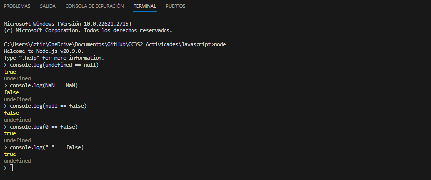
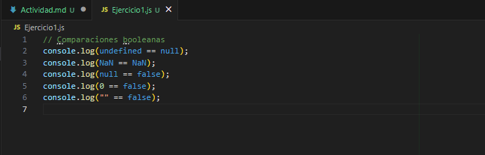
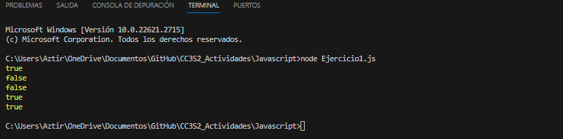
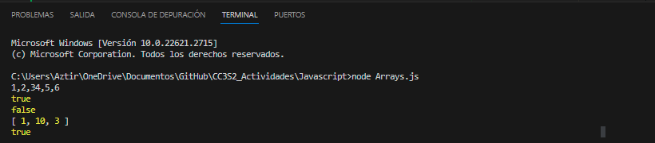
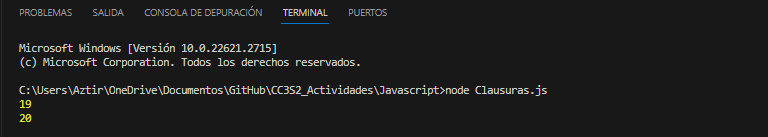
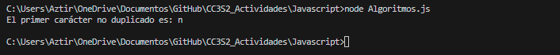
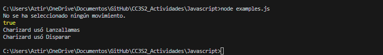

## Java Script
La comunidad de JavaScript ha florecido en los últimos años y frameworks como [React](https://react.dev/) y [Node.js](https://nodejs.org/en) hacen posible escribir aplicaciones completas en JavaScript. Nos centraremos principalmente en el lenguaje JavaScript, AJAX, DOM y Eventos/Callback. 

### Preguntas conceptuales

**En JavaScript, todas las operaciones de red son asíncronas. ¿Porque es esto importante?** 

La asincronicidad significa que si JavaScript tiene que esperar a que se complete una operación, ejecutará el resto del código mientras espera. Esto es crucial para que se garantice que las operaciones de red no bloqueen manteniendo asi la capacidad de respuesta.
Ya que si llega a bloquearse dichas operaciones la interfaz de usuario se volvería no receptiva y parecería congelada hasta que la operación de red termine.  

**En Javascript, queremos realizar acciones tras una operación/solicitud de red completa. ¿Qué paradigma de programación hace esto posible?**

El paradigma de Programación Orientada a Eventos en JavaScript permite realizar acciones después de completarse operaciones asíncronas, como las solicitudes de red. En lugar de esperar activamente a que la operación termine, se utilizan funciones de devolución de llamada (callbacks) que se ejecutan cuando la operación finaliza. Esto permite que el programa siga ejecutándose de manera eficiente mientras espera respuestas de la red, lo que es esencial para construir aplicaciones web interactivas y receptivas

**¿Javascript proporciona soporte limitado para la herencia a través de qué mecanismo?**

En JavaScript, cuando hablamos de herencia, nos referimos a la idea de que un objeto puede heredar propiedades y métodos de otro objeto. Y la herramienta clave que hace posible esto son los "prototipos". Pensamos en los prototipos como un conjunto de características que pueden ser compartidas entre diferentes tipos de objetos.

**¿Qué es el DOM? ¿Qué librería nos ayuda a usar Javascript para manipular el DOM?**

Document Objet Model, es una representacion estructurada de documentos HTML/XML,nos proporciona una interfaz que JavaScript utiliza para trabajar dinamicamente su estructura, contenido y estilo de documento.


### ¿Qué puede hacer Javascript ?

Al igual que Ruby, Javascript sigue de cerca el paradigma de "todo es un objeto" con un par de excepciones. La breve lista de primitivas incluye `String`, `Númber`, `undefined` (sin valor), `null` (diferente de `undefined`), Booleano y `BigInt`. Además, al igual que Ruby, los valores de JavaScript se escriben dinámicamente, por lo que las declaraciones de variables están precedidas por `var` o `let`, en lugar de tipos.

Dicho esto, Javascript tiene muchas idiosincrasias interesantes que vale la pena considerar. Para codificar eficazmente en Javascript, vale la pena familiarizarse con estas peculiaridades. En esta sección, repasaremos varios de ellos con un conjunto más que familiar de preguntas sobre "¿Qué haría Javascript?".

#### Booleano

Exploramos el comportamiento de valores "Falsy" en JavaScript mediante comparaciones en el terminal. Los valores "Falsy" (como 0, null, undefined, false, NaN y "") evalúan como falsos en condiciones booleanas. Aq 

Evalumos las siguientes condiciones:

* `undefined == null`
* `NaN == NaN`
* `null == false`
* `0 == false`
* `"" == false`

 
Para llevar a cabo esta actividad, abrimos una consola en Node en Visual Studio Code y verificamos las líneas de código, como se muestra a continuación:



Además, creamos un archivo llamado "Ejercicio1" con las mismas sentencias y confirmamos que produce los mismos resultados:





Después de analizar las salidas obtenidas, podemos proporcionar explicaciones concisas para cada comparación:

1. `console.log(undefined == null) // true`: En JavaScript, `undefined` y `null` se consideran equivalentes en una comparación directa.

2. `console.log(NaN == NaN) // false`: La comparación de dos instancias de `NaN` siempre resulta en falso, ya que `NaN` no es considerado igual a sí mismo.

3. `console.log(null == false) // false`: A pesar de que ambos son valores "Falsy," `null` y `false` no son considerados iguales en una comparación.

4. `console.log(0 == false) // true`: El valor `0` y `false` son equivalentes en una comparación booleana, ya que ambos son tratados como "Falsy."

5. `console.log("" == false) // true`: Una cadena de texto vacía (`""`) y `false` se consideran iguales en una comparación booleana, ya que ambas son interpretadas como "Falsy."


#### Arrays

Los arrays son una de las estructuras de datos centrales en Javascript, pero se comportan de maneras interesantes. En este ejercicio, veremos algunos de los comportamientos relativamente extraños de las operaciones tradicionales con arrays.

* `[1, 2, 3] + [4, 5, 6]`
* `!![]`
* `[] == true`
* `[10, 1, 3].sort()`
* `[] == 0​`

Para ello creamos un archivo llamado "Arrays.js" que contiene las sentencias anteriores y evaluaremos la salida que este archivo nos da al momento de ejecutarlo.



Ejecutamos el archivo en Node.js para observar las salidas.
 
1. **Suma de Arrays:**  `[1, 2, 3] + [4, 5, 6]`
   - **Resultado:** "1,2,34,5,6"
   - **Explicación:** En este caso, JavaScript convierte ambos arrays a cadenas de texto y los concatena en lugar de realizar una suma aritmética. Esto se debe a que el operador `+` tiene diferentes comportamientos dependiendo del tipo de operandos, y en este caso, el operando es un array.

2. **Doble Negación de Array:**`!![]`
   - **Resultado:** `true`
   - **Explicación:** La doble negación `!!` convierte un valor a su equivalente booleano. En este caso, un array no vacío se evalúa como `true`, por lo que `!![]` es `true`.

3. **Comparación entre Array y Booleano:**`[] == true`
   - **Resultado:** `false`
   - **Explicación:** La comparación de un array vacío con un booleano (`true`) en JavaScript devuelve `false`. Esto se debe a las reglas de conversión de tipos, donde el array se convierte a un valor numérico durante la comparación.

4. **Ordenamiento de Array:**`[10, 1, 3].sort()`
   - **Resultado:** `[1, 10, 3]`
   - **Explicación:** El método `sort()` convierte los elementos del array a cadenas y los compara Unicode code point por code point. Esto puede resultar en un ordenamiento inesperado para números, ya que se realiza una comparación de caracteres en lugar de valores numéricos.

5. **Comparación entre Array vacío y Número:**`[] == 0​`
   - **Resultado:** `true`
   - **Explicación:** En este caso, el array vacío se convierte a un valor numérico durante la comparación, y el valor numérico de un array vacío es 0. Por lo tanto, `[].toString()` es igual a `"0"`, y la comparación devuelve `true`.

#### Clausuras

En JavaScript, las clausuras son una combinación de funciones y referencias al estado circundante. Este código ejemplifica el uso de clausuras:

```
function f1(x) {
  var baz = 3;
  return function (y) {
    console.log(x + y + (baz++));
    }
}
var bar = f1(5);
bar(11);
```

En este código de JavaScript, la función `f1` crea una especie de "paquete" llamado clausura. Esta clausura contiene una función interna que tiene acceso a la variable `baz` y al parámetro `x` de la función externa `f1`. Al llamar a `f1(5)`, obtenemos una clausura que llamamos `bar`. Cuando ejecutamos `bar(11)`, la función interna dentro de la clausura realiza cálculos usando `x`, `y` y una variable llamada `baz`, que incrementa en cada llamada. 




Así, la consola imprime los resultados de estas operaciones, mostrando cómo las clausuras pueden "recordar" el contexto en el que fueron creadas, incluso después de que la función externa haya terminado de ejecutarse. En este caso, vemos resultados de `19` y `20`.


#### Algoritmos

La siguiente función encuentra el mayor número dentro de un array, pero tiene una eficiencia de `O(N2)`. Reescribe la función para que se convierta en una `O(N)``más rápida:

```
def greatestNumber(array):
   for i in array:
     isIValTheGreatest = True
     for j in array:
      if j > i:
         isIValTheGreatest = False
    if isIValTheGreatest:
      return i
```

Para mejorar la eficiencia de la función `greatestNumber`, se cambió el enfoque para recorrer el array solo una vez, encontrando el mayor número durante esa iteración. Esto reduce la complejidad temporal a `O(N)`.

```javascript
function findGreatestNumber(array) {
  let greatestNumber = array[0];

  for (let i = 1; i < array.length; i++) {
    if (array[i] > greatestNumber) {
      greatestNumber = array[i];
    }
  }

  return greatestNumber;
}
```
 
La siguiente función devuelve si hay o no una “X” mayúscula dentro de una cadena.

```
function containsX(string) {
  foundX = false;
  for(let i = 0; i < string.length; i++) {
   if (string[i] === "X") {
     foundX = true;
     }
   }
   return foundX;
  }
```

¿Cuál es la complejidad temporal de esta función en términos de notación O grande? Luego, modifica el código para mejorar la eficiencia del algoritmo en los mejores y promedios escenarios.

La complejidad temporal de la función `containsX` es \(O(N)\), donde \(N\) es la longitud de la cadena de entrada. La razón de esto es que la función realiza un bucle que recorre cada carácter de la cadena una vez, y la cantidad de iteraciones es directamente proporcional a la longitud de la cadena.


Una manera mejorar la eficiencia es utilizando el bucle `for...of` en lugar del bucle `for` clásico. El bucle `for...of` itera directamente sobre los caracteres de la cadena, haciendo el código más limpio y potencialmente más eficiente. Aquí está la versión modificada:

```javascript
function containsX(string) {
  for (let char of string) {
    if (char === "X") {
      return true; // Se encontró la letra "X", terminamos la búsqueda
    }
  }
  return false; // No se encontró la letra "X" en toda la cadena
}
```

Este enfoque es más conciso y sigue manteniendo una complejidad temporal de \(O(N)\), ya que aún se está iterando sobre cada carácter de la cadena en el peor caso.


Escribe una función que devuelva el primer carácter no duplicado de una cadena. Por ejemplo, la cadena "mínimum" tiene dos caracteres que solo existen una vez: la "n" y la "u", por lo que su función debería devolver la "n", ya que aparece primero. La función debe tener una eficiencia de `O(N)`.

La función `firstNonDuplicateChar` encuentra el primer carácter no duplicado de una cadena con eficiencia `O(N)`. Utiliza un mapa para rastrear la frecuencia de cada carácter en una sola iteración de la cadena.

```javascript
function firstNonDuplicateChar(str) {
    const charFrequency = {};
  
    for (let char of str) {
      charFrequency[char] = (charFrequency[char] || 0) + 1;
    }
  
    for (let char of str) {
      if (charFrequency[char] === 1) {
        return char;
      }
    }
  
    return null; // Si no hay caracteres no duplicados
  }
```

Probaremos la funcion anterior con la siguiente cadena  `exampleString = "minimum" `para ver si nos devuelve el valor duplicado, en este caso "n".



#### Clases

Practiquemos la herencia y la programación orientada a objetos en Javascript. Diseñe 2 clases, una llamada "Pokemon" y otra llamada "Charizard". Las clases deben hacer lo siguiente:

Clase Pokémon:

- El constructor toma 3 parámetros (HP, ataque, defensa)
- El constructor debe crear 6 campos (HP, ataque, defensa, movimiento, nivel, tipo). Los valores de (mover, nivelar,
tipo) debe inicializarse en ("", 1, "").
– Implementa un método `flight` que arroje un error que indique que no se especifica ningún movimiento.
– Implementa un método `canFly` que verifica si se especifica un tipo. Si no, arroja un error. Si es así, verifica si el tipo incluye "volar". En caso afirmativo, devuelve verdadero; si no, devuelve falso.

Clase Charizard:

– El constructor toma 4 parámetros (HP, ataque, defensa, movimiento)
– El constructor configura el movimiento y el tipo (para "disparar/volar") además de establecer HP, ataque y defensa como el
constructor de superclase.
– Sobreescribe el método `fight`. Si se especifica un movimiento, imprime una declaración que indique que se está utilizando el movimiento y devuelve el campo de ataque. Si no, arroja un error.


En este ejercicio, se crearon dos archivos principales: `pokemon.js` y `examples.js`, para implementar la funcionalidad de las clases "Pokemon" y "Charizard" en JavaScript.

### Archivo `pokemon.js`:

Este archivo contiene la definición de las clases `Pokemon` y `Charizard`. Aquí hay una breve descripción de cada clase:

- **Clase `Pokemon`:**
  - Representa a un Pokémon genérico con propiedades como puntos de salud (`HP`), ataque (`ataque`), defensa (`defensa`), movimiento (`movimiento`), nivel (`nivel`) y tipo (`tipo`).
  - Ofrece métodos como `fight()` que verifica si se ha seleccionado algún movimiento y `canFly()` que verifica si el Pokémon puede volar.
  
- **Clase `Charizard`:**
  - Hereda de la clase `Pokemon` y representa a Charizard.
  - Agrega un constructor que configura específicamente el movimiento y el tipo de Charizard.
  - Sobreescribe el método `fight()` para personalizar la lógica de combate de Charizard.

### Archivo `examples.js`:

Este archivo contiene ejemplos de uso de las clases definidas en `pokemon.js`. Se crean instancias de Pokémon y Charizard, y se realizan diversas operaciones para ilustrar las funcionalidades de las clases. Algunos ejemplos incluyen la validación de movimientos, la comprobación de tipos y la realización de acciones específicas de Charizard.

En el archivo `examples.js`, se proporcionan cinco ejemplos que ilustran el uso de las clases `Pokemon` y `Charizard`:

1. **Ejemplo 1:**
   - Creación de un Pokemon sin movimiento y tipo.
   - Debería lanzar un error indicando "No se ha seleccionado ningún movimiento."

2. **Ejemplo 2:**
   - Creación de un Pokemon con movimiento y tipo "Volar".
   - Debería imprimir `true`, indicando que el Pokemon puede volar.

3. **Ejemplo 3:**
   - Creación de un Charizard sin movimiento.
   - Debería lanzar un error indicando "No se ha seleccionado ningún movimiento."

4. **Ejemplo 4:**
   - Creación de un Charizard con movimiento personalizado ("Lanzallamas").
   - Debería imprimir "Charizard usó Lanzallamas."

5. **Ejemplo 5:**
   - Creación de un Charizard sin especificar un movimiento (utilizando el movimiento por defecto "Disparar").
   - Debería imprimir "Charizard usó Disparar."

Se puede comprobar lo expuesto con la siguiente salida de la ejecucion del archivo `examples.js`

