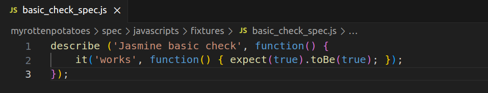
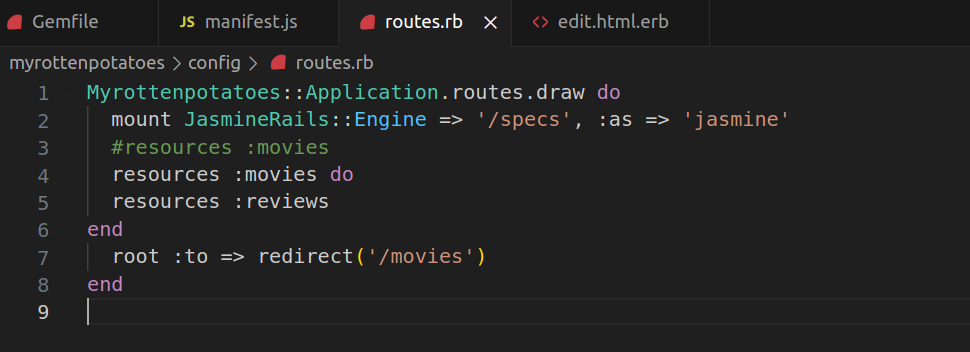
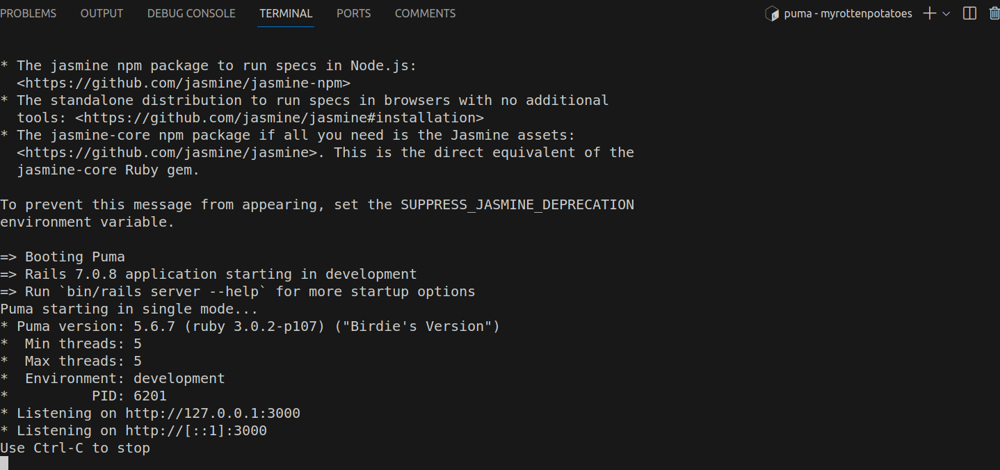
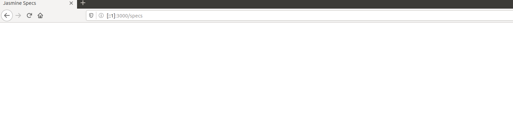
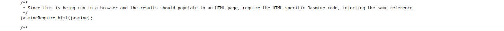
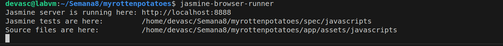
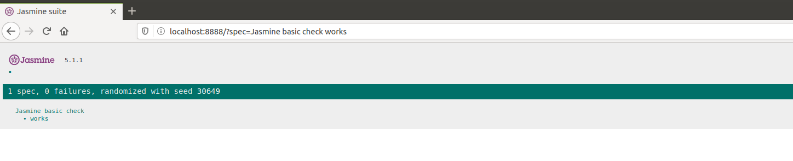
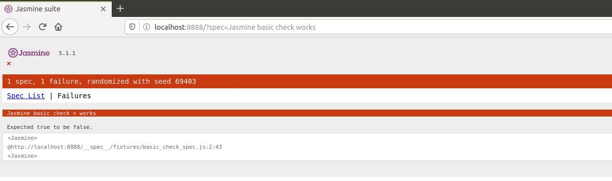
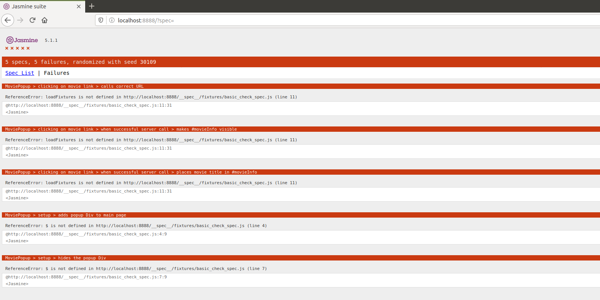

# Testing Java Script y Ajax


## Paso 1: Configuración inicial

Para empezar a utilizar [Jasmine](https://jasmine.github.io/), añadimos `gem jasmine` en nuestro  Gemfile y ejecutamos bundle install como siempre; después, ejecuta los comandos siguientes desde el directorio raíz de su aplicación.


Una vez añadida la gema necesaria al archivo gemfile, procedemos a instalarla ejecutando el siguiente comando:

```
bundle install
```

La instalación de la gema Jasmine se realiza correctamente, como se muestra en la siguiente imagen.


A continuación, ejecutamos los siguientes comandos desde el directorio raíz de nuestra aplicación:

```
rails generate jasmine:install 
```


Creamos el directorio para los fixtures de Jasmine mediante el siguiente comando:

```
mkdir spec/javascripts/fixtures 
```


## Paso 2: Creación de una prueba básica

Creamos el archivo `spec/javascripts/basic_check_spec.js` con el siguiente contenido:

   ```javascript
   describe('Jasmine basic check', function() {
     it('works', function() {
       expect(true).toBe(true);
     });
   });
   ```

Este código utiliza Jasmine para realizar una prueba simple, verificando que el sistema de pruebas esté listo. La prueba compara si el valor booleano true es idéntico a true. Dado que esta afirmación es siempre verdadera, la prueba valida la configuración básica del entorno de pruebas Jasmine.



Despues de crear el conjunto de pruebas, agregamos `/= link boot0.js` en la ubicacion `app/assets/config/manifest.js`


Además en la ubicacion `config/routes.` agregar la siguientes lineas de codigo para que coincida con la ruta `/spec` y que este configurada para manejar solicitudes GET.



Iniciamos nuestra aplicación con:

   ```bash
   rails server
   ```



Accedemos a las pruebas Jasmine en el navegador (por ejemplo, http://localhost:3000/specs) y verificamos que la prueba básica se ejecuta correctamente.



Como se observa, si bien la salidanos dice que se cargo correctamete la aplicación, se puede observar que no se cargan todos los datos, para saber más del problema inspeccionamos la pagina a ver si nos puede dar un poco más de información sobre los posibles errores:


Este error indica que hay un problema en el archivo `boot-e820afaf0854f70bb7dd80f15bb298d9c55115e9971011dace41609df63e4e65.js` en las líneas 52 y 167. Parece que hay un intento de llamar a una función `jasmineRequire.html` que no está definida, lo cual podría deberse a una configuración incorrecta o a la falta de carga adecuada de las dependencias de Jasmine. 



Se buscó una solución actualizando las gemas y observando el archivo jasmine.yml, pero no se encontró una solución al problema. Es por eso que optamos por trabajar con el terminal para ejecutar las pruebas.


Escribimos el siguiente comando  `jasmine-browser-runner` en nuestro terminal y esto esperamos a que se cargue la página de la aplicación.



 
En el terminal nos muestra que el servidor de Jasmine se esta ejecutando en http://localhost:8000/, accedemos al link y se puede observar lo siguiente



La imagen nos indica que la prueba paso exitosamente, ya que como mencionamos nuestra prueba compara si el valor booleano true es idéntico a true.

Modificamos el codigo  

Pero observamos si cambios uno de los valores boleeanos por false, se observa que nuestra prueba ha resultado en un fallo. La especificación esperaba que una afirmación fuera falsa, pero en la ejecución resultó ser verdadera. El mensaje de error indica "Expected true to be false".



#### Pregunta 1: ¿Cuáles son los problemas que se tiene cuando se debe probar Ajax?. Explica tu respuesta.

Cuando probamos Ajax, nos enfrentamos a algunos problemas comunes, como la asincronía, el manejo de respuestas asíncronas y la dependencia de servicios externos.

1. **Asincronía:** Las operaciones Ajax ocurren de manera asíncrona, lo que complica la secuencia de ejecución de las pruebas y puede generar resultados impredecibles si no se manejan adecuadamente.

2. **Respuestas Asíncronas:** La gestión de respuestas asíncronas requiere cuidado para garantizar que las pruebas esperen el resultado correcto antes de evaluarlo, evitando falsos positivos o negativos.

3. **Dependencia de Servicios Externos:** Las llamadas Ajax a menudo interactúan con servicios externos, lo que puede introducir dependencias difíciles de controlar en el entorno de prueba. Es crucial simular estas interacciones para garantizar la consistencia de las pruebas.

4. **Actualización Dinámica del Contenido:** Dado que Ajax se utiliza para actualizar dinámicamente el contenido de las páginas web, las pruebas deben verificar que estos cambios se reflejen correctamente y no afecten negativamente otras partes de la aplicación.

5. **Manejo de Errores Asíncronos:** Las pruebas deben abordar posibles errores en las operaciones Ajax, como tiempos de espera o respuestas inesperadas, para garantizar que se manejen de manera adecuada y no afecten la integridad de la aplicación.

#### Pregunta 2: ¿Qué son los stubs, espias y fixture en Jasmine para realizar pruebas de Ajax?

- **Stubs:** Son funciones que reemplazan las implementaciones originales de funciones para controlar su comportamiento durante las pruebas.
- **Espías:** Permiten rastrear llamadas a funciones y verificar su comportamiento.
- **Fixture:** Datos de prueba utilizados en las pruebas para simular el entorno de la aplicación.

#### Pregunta: Experimenta el siguiente código de especificaciones (specs) de Jasmine del camino feliz del código AJAX llamado `movie_popup_spec.js`.

Experimentamos con el código de especificaciones en `movie_popup_spec.js`.

 ```
describe('MoviePopup', function() {
  describe('setup', function() {
    it('adds popup Div to main page', function() {
      expect($('#movieInfo')).toExist();
    });
    it('hides the popup Div', function() {
      expect($('#movieInfo')).toBeHidden();
    });
  });
  describe('clicking on movie link', function() {
    beforeEach(function() { loadFixtures('movie_row.html'); });
    it('calls correct URL', function() {
      spyOn($, 'ajax');
      $('#movies a').trigger('click');
      expect($.ajax.calls.mostRecent().args[0]['url']).toEqual('/movies/1');
    });
    describe('when successful server call', function() {
      beforeEach(function() {
        let htmlResponse = readFixtures('movie_info.html');
        spyOn($, 'ajax').and.callFake(function(ajaxArgs) { 
          ajaxArgs.success(htmlResponse, '200');
        });
        $('#movies a').trigger('click');
      });
      it('makes #movieInfo visible', function() {
        expect($('#movieInfo')).toBeVisible();
      });
      it('places movie title in #movieInfo', function() {
        expect($('#movieInfo').text()).toContain('Casablanca');
      });
    });
  });
});
 ```

 

Nos sale este error debido a que parece que no se configuro correctamente JQuery.

#### Pregunta: ¿Que hacen las siguientes líneas del código anterior?. ¿Cuál es el papel de spyOn de Jasmine y los stubs en el código dado.
 ```
it('calls correct URL', function() {
      spyOn($, 'ajax');
      $('#movies a').trigger('click');
      expect($.ajax.calls.mostRecent().args[0]['url']).toEqual('/movies/1');
    });
 ```
La primera línea utiliza `spyOn` para espiar la función `$.ajax` y luego verifica que la URL sea correcta después de hacer clic en un enlace.

Las siguientes líneas simulan una llamada exitosa al servidor y verifican la visibilidad del elemento `#movieInfo` y el contenido del mismo.

#### Pregunta 3: ¿Que hacen las siguientes líneas del código anterior?.

Las líneas de código:

```javascript
 let htmlResponse = readFixtures('movie_info.html');
        spyOn($, 'ajax').and.callFake(function(ajaxArgs) { 
          ajaxArgs.success(htmlResponse, '200');
        });
        $('#movies a').trigger('click');
      });
      it('makes #movieInfo visible', function() {
        expect($('#movieInfo')).toBeVisible();
      });
      it('places movie title in #movieInfo', function() {
        expect($('#movieInfo').text()).toContain('Casablanca');

```
 Estas líneas de código están dentro de una suite de pruebas Jasmine y se centran en simular una llamada Ajax exitosa y verificar el comportamiento resultante:

1. **`let htmlResponse = readFixtures('movie_info.html');`**
   - Se carga un conjunto de datos simulados desde el archivo 'movie_info.html'.

2. **`spyOn($, 'ajax').and.callFake(function(ajaxArgs) { ajaxArgs.success(htmlResponse, '200'); });`**
   - Se espía la función `$.ajax` para simular una llamada Ajax exitosa, usando datos simulados y un código de estado '200'.

3. **`$('#movies a').trigger('click');`**
   - Se simula hacer clic en un enlace dentro del elemento con ID 'movies', desencadenando la llamada Ajax simulada.

4. **`it('makes #movieInfo visible', function() { expect($('#movieInfo')).toBeVisible(); });`**
   - Se prueba que el elemento con ID 'movieInfo' se vuelva visible después de la llamada Ajax simulada.

5. **`it('places movie title in #movieInfo', function() { expect($('#movieInfo').text()).toContain('Casablanca'); });`**
   - Se verifica que el contenido del elemento con ID 'movieInfo' contiene el texto 'Casablanca' después de la llamada Ajax simulada.

En resumen, estas líneas establecen un entorno controlado para probar la interacción de JavaScript con Ajax y el DOM, asegurándose de que la respuesta esperada de la llamada Ajax se refleje correctamente en la interfaz de usuario.
### Verificación de la Función `setup`

Verificamos que la función `setup` en `movie_popup.js` se ejecute correctamente. Cargamos la página y confirmamos que el elemento `#movieInfo` se agregue y esté oculto.

#### Pregunta: Dado que Jasmine carga todos los ficheros JavaScript antes de ejecutar ningún ejemplo, la llamada a setup (línea 34 del codigo siguiente llamado `movie_popup.js`)ocurre antes de que se ejecuten nuestras pruebas, comprueba que dicha función hace su trabajo y muestra los resultados.

```
var MoviePopup = {
  setup: function() {
    // add hidden 'div' to end of page to display popup:
    let popupDiv = $('<div id="movieInfo"></div>');
    popupDiv.hide().appendTo($('body'));
    $(document).on('click', '#movies a', MoviePopup.getMovieInfo);
  }
  ,getMovieInfo: function() {
    $.ajax({type: 'GET',
            url: $(this).attr('href'),
            timeout: 5000,
            success: MoviePopup.showMovieInfo,
            error: function(xhrObj, textStatus, exception) { alert('Error!'); }
            // 'success' and 'error' functions will be passed 3 args
           });
    return(false);
  }
  ,showMovieInfo: function(data, requestStatus, xhrObject) {
    // center a floater 1/2 as wide and 1/4 as tall as screen
    let oneFourth = Math.ceil($(window).width() / 4);
    $('#movieInfo').
      css({'left': oneFourth,  'width': 2*oneFourth, 'top': 250}).
      html(data).
      show();
    // make the Close link in the hidden element work
    $('#closeLink').click(MoviePopup.hideMovieInfo);
    return(false);  // prevent default link action
  }
  ,hideMovieInfo: function() {
    $('#movieInfo').hide();
    return(false);
  }
};
$(MoviePopup.setup);


```

#### Pregunta 5: Indica cuales son los stubs y fixtures disponibles en Jasmine y Jasmine-jQuery.

- **Stubs en Jasmine:** Se utilizan con `spyOn` para controlar el comportamiento de funciones durante las pruebas.
- **Fixtures en Jasmine y Jasmine-jQuery:** Proporcionan datos de prueba y se cargan dentro de `div#jasmine-fixtures` para simular el entorno de la aplicación.

#### Pregunta 6:  Como en RSpec, Jasmine permite ejecutar código de inicialización y desmantelamiento de pruebas utilizando beforeEach y afterEach. El código de inicialización carga el fixture HTML mostrado en el código siguiente, para imitar el entorno que el manejador getMovieInfo vería si fuera llamado después de mostrar la lista de películas.

```
<div id="movies">
  <div class="row">
    <div class="col-8"><a href="/movies/1">Casablanca</a></div>
    <div class="col-2">PG</div>
    <div class="col-2">1943-01-23</div>
  </div>
</div>
```

En Jasmine, `beforeEach` y `afterEach` permiten ejecutar código de inicialización y desmantelamiento antes y después de cada prueba, respectivamente.

### Ejercicios

11. **Herencia de Prototipos y Métodos Privados en JavaScript:**

   Implementamos un constructor para objetos `User` que acepta un nombre de usuario y una contraseña. Proporcionamos un método `checkPassword` para verificar la contraseña sin revelarla.

12. **Identificación de Filas Ocultas:**

   Utilizando solo JavaScript del lado cliente, identificamos filas ocultas en una tabla sin modificar el código del servidor.

13. **Código AJAX para Menús en Cascada:**

   Escribimos código AJAX para crear menús en cascada basados en la asociación `has_many` en Rails.

14. **Extensión de Validación en ActiveModel:**

   Extendemos la función de validación en ActiveModel para generar automáticamente código JavaScript que valide las entradas del formulario antes de ser enviado.
