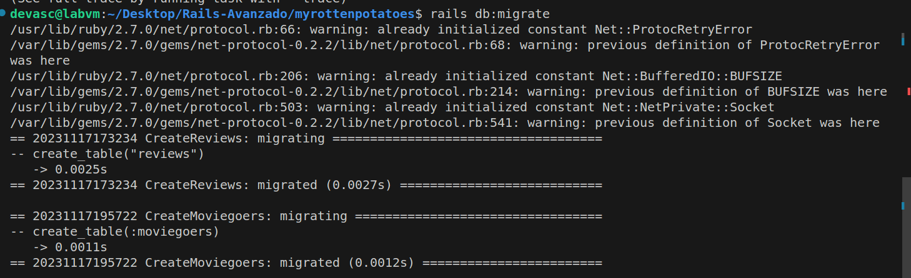

# Rails-Avanzado

## Sección 0: Introducción y Errores Iniciales

### Descripción Inicial:

El código proporcionado inicialmente tiene algunos errores en la lógica del proceso del uso de frameworks y presenta casi todos los tópicos avanzados en clase.

### Errores Iniciales:

Los primeros errores se encuentran en el archivo `app/controllers/application_controller.rb`, donde llamamos a un método de la clase `Moviegoer`, la cual no existe.
Inicio del error:

!
Para corregir esto, cambiaremos la referencia a la clase `Movie`.
  
Luego de cambiar por `Movie`:

Vemos que el error ha cambiado, ahora enfrentamos un error de sintaxis. Este problema se encuentra en la carpeta `app/models`. 


Aquí, debemos quitar los comentarios y ejecutar nuevamente el servidor.


Ahora, el error ha sido corregido. Podemos visualizar las películas y alguna información adicional. Además, ahora podemos agregar nuevas películas.

## Sección 1: Vistas parciales, validaciones y filtros

### Vistas Parciales:

Una vista parcial es el nombre de Rails para una parte reutilizable de una vista. Cuando debe aparecer contenido similar en diferentes vistas.

Según la actividad, nos sugiere , colocar ese contenido en una parte e “incluirlo” en archivos separados ayuda a DRY la repetición.

Creamos el archivo `_movie.html.erb` en el directorio `app/views` e incluimos este fragmento de codigo, que actuara como una vsta parcial.

``` html
<div class="row">
    <div class="col-8"> <%= link_to movie.title, movie_path(movie) %> </div>
    <div class="col-2"> <%= movie.rating %> </div>
    <div class="col-2"> <%= movie.release_date.strftime('%F') %> </div>
</div>
``` 

Actualizamos la línea `<%= render partial: 'movie', collection: @movies %>` del archivo `index.html.haml ` para que coincida con la nueva ubicación.

``` html
<!--  ...other code from index.html.erb here... -->
<div class="row bg-dark text-white">
    <div class="col-6 text-center">Title and More Info</div>
    <div class="col-2 text-center">Rating</div>
    <div class="col-4 text-center">Release Date</div>
</div>
<%= render partial: 'movie', collection: @movies %>
``` 

También cambiaremos el formato de html.haml a html.erb del archivo anteriormente mencionado `index.html.haml `


Ahora si observamos que al ejecutar nuestro servidor, no hay ningun error y se pueden observar las tablas.


### Validaciones de Modelos:

Las validaciones de modelos, al igual que las migraciones, se expresan en un mini-DSL integrado en Ruby, como muestra en el siguiente código.Agregamos el código de validación al modelo `Movie` que se proporciona.
``` ruby
class Movie < ActiveRecord::Base
    def self.all_ratings ; %w[G PG PG-13 R NC-17] ; end #  shortcut: array of strings
    validates :title, :presence => true
    validates :release_date, :presence => true
    validate :released_1930_or_later # uses custom validator below
    validates :rating, :inclusion => {:in => Movie.all_ratings},
        :unless => :grandfathered?
    def released_1930_or_later
        errors.add(:release_date, 'must be 1930 or later') if
        release_date && release_date < Date.parse('1 Jan 1930')
    end
    @@grandfathered_date = Date.parse('1 Nov 1968')
    def grandfathered?
        release_date && release_date < @@grandfathered_date
    end
end
``` 

Verificamos los resultados en la consola utilizando el código de ejemplo proporcionado.


Se creó una instancia llamada m de la clase Movie con un título vacío, un rating incorrecto y una fecha de lanzamiento anterior a 1930. Al ejecutar las validaciones, se obtuvo un resultado de false, indicando problemas de validación. Se generaron mensajes de error específicos para el título, señalando que no puede estar en blanco, y para la fecha de lanzamiento, indicando que debe ser en 1930 o posterior. 

### Controlador de Películas (`MoviesController`):

Analizamos y entiendemos el código del controlador proporcionado. Comprendemos cómo se manejan las acciones `new`, `create`, `edit`, `update`, y `destroy`.

``` ruby
class MoviesController < ApplicationController
  def new
    @movie = Movie.new
  end 
  def create
    if (@movie = Movie.create(movie_params))
      redirect_to movies_path, :notice => "#{@movie.title} created."
    else
      flash[:alert] = "Movie #{@movie.title} could not be created: " +
        @movie.errors.full_messages.join(",")
      render 'new'
    end
  end
  def edit
    @movie = Movie.find params[:id]
  end
  def update
    @movie = Movie.find params[:id]
    if (@movie.update_attributes(movie_params))
      redirect_to movie_path(@movie), :notice => "#{@movie.title} updated."
    else
      flash[:alert] = "#{@movie.title} could not be updated: " +
        @movie.errors.full_messages.join(",")
      render 'edit'
    end
  end
  def destroy
    @movie = Movie.find(params[:id])
    @movie.destroy
    redirect_to movies_path, :notice => "#{@movie.title} deleted."
  end
  private
  def movie_params
    params.require(:movie)
    params[:movie].permit(:title,:rating,:release_date)
  end
end

 ``` 

* `new` : Esta acción, permite la creación de una nueva instancia de la clase Movie.  
* `create` :Nos permite manejar la creacion de una pelicula con los datos mandados desde un formulario, si esta es exitosa entonces da un mensaje de exito y redirige a la lista de peliculas, de lo contrario da un mensaje de error y vuelvo al formulario de creacion.  
* `edit` : Esta acción permite editar la informacion de una pelicula, buscandola a traves de un id.  
* `update` : Maneja la actualizacion de una pelicula que ya existe, si la actualiza exitosamente entonces redirige a la pagina de informacion de la pelicula, si falla nos redirige a la pagina de edicion.  
* `destroy` : Maneja la destruccion de una pelicula por medio de su id.  
* `movie_params` : Gestiona los parametros que podemos enviar a traves de nuestras peticiones.


### Canonicalización de Campos del Modelo:

Agregamos el método `capitalize_title` al modelo `Movie` para capitalizar el título antes de guardarlo. Este método se encargará de transformar el título de la película para que cada palabra comience con una letra mayúscula y el resto de las letras sea minúscula. 

 ```ruby
class Movie < ActiveRecord::Base
    before_save :capitalize_title
    def capitalize_title
        self.title = self.title.split(/\s+/).map(&:downcase).
        map(&:capitalize).join(' ')
    end
end
 ``` 

Verificamos los resultados en la consola, para  comprobar si funciona la canonicalizacion, para esto se crea una nueva instancia de la clase Movie con atributos específicos, incluyendo un título ('STAR wars'), una fecha de lanzamiento ('127-5-1977) y una clasificación ('PG').


AL utilizar el método create! este válida los datos ingresados antes de insertarlos a la base de datos, además que al escribir   `m.title` en la consola se observa que el título se ha estandarizado y capitalizado como "Star Wars", como se muestra a continuación:


### Filtro del Controlador:

Analizamos el código del filtro en `ApplicationController`, entendemos cómo se utiliza el filtro `before_filter` para asegurar que un usuario esté autenticado.

 ```ruby
class ApplicationController < ActionController::Base
    before_filter :set_current_user
    protected # prevents method from being invoked by a route
    def set_current_user
        # we exploit the fact that the below query may return nil
        @current_user ||= Moviegoer.where(:id => session[:user_id])
        redirect_to login_path and return unless @current_user
    end
end
 ```

Este método verifica la existencia de un usuario autenticado basándose en la información de sesión. Si no se encuentra un usuario, redirige a la página de inicio de sesión, asegurando así la autenticación antes de permitir el acceso a las acciones del controlador.

## Sección 2: SSO y Autenticación a través de Terceros

### Configuración Inicial:

Para continuar con la implementación de la autenticación a través de terceros en nuestra aplicación Rails, sigue los siguientes pasos:

Ejecutaremos el siguiente comando en la terminal para generar un modelo Moviegoer y una migración asociada:

 ```
 rails generate model Moviegoer name:string provider:string uid:string
 ```

Al ejecutar ese comando, nos encontramos con la siguiente situación, el mensaje de error indica que el nombre "Moviegoer" ya está siendo utilizado en nuestra aplicación o está reservado por Ruby on Rails.  


Esto podría deberse a que ya existe un modelo en nuestra aplicación, para ello comprobaremos utilizando el siguiente comando.Este comando buscará en todos los archivos de modelos (./app/models) cualquier referencia a la clase Moviegoer. 

 ```
grep -r 'class Moviegoer' ./app/models
 ```

El resultado del comando grep indica que ya existe un archivo de modelo llamado moviegoer.rb en el directorio ./app/models y que contiene la definición de la clase Moviegoer. Por lo tanto, el modelo ya existe nuestra aplicación.

 

Luego nos pide editar el archivo app/models/moviegoer.rb generado para que coincida con este codigo
 ```ruby
# Edit app/models/moviegoer.rb to look like this:
class Moviegoer < ActiveRecord::Base
    def self.create_with_omniauth(auth)
        Moviegoer.create!(
        :provider => auth["provider"],
        :uid => auth["uid"],
        :name => auth["info"]["name"])
    end
end
 ```

La función self.create_with_omniauth(auth) en el modelo Moviegoer permite la creación eficiente de un nuevo registro de usuario al autenticar a través de OmniAuth. Este método simplifica la integración de la información de autenticación proporcionada por un proveedor externo.
 


Ya nuestro modelo esta correctamene configurado, ahora realizaremos la migraciòn correspondiente para crear la tabla en su base de datos, como se muestra a continuaciòn:


Luego ejecutamos la migraciòn para aplicar los cambios en la base de datos


### OmniAuth y Configuración:

La autenticación del usuario a través de un tercero se simplifica mediante la utilización de la gema OmniAuth, que ofrece una API uniforme para varios proveedores de SSO. Para habilitar la autenticación, agregamos las gemas necesarias al archivo Gemfile:

 ```
gem 'omniauth'
gem 'omniauth-twitter'
 ```

Posteriormente, al instalar estas gemas, configuramos las rutas en el archivo `config/routes.rb` para gestionar el flujo de autenticación:

 ```ruby
#routes.rb
get  'auth/:provider/callback' => 'sessions#create'
get  'auth/failure' => 'sessions#failure'
get  'auth/twitter', :as => 'login'
post 'logout' => 'sessions#destroy'
 ```

Adicionalmente, en el controlador SessionsController (ubicado en app/controllers/sessions_controller.rb), implementamos las acciones necesarias para el manejo de sesiones:

```ruby
class SessionsController < ApplicationController
  # login & logout actions should not require user to be logged in
  skip_before_filter :set_current_user  # check you version
  def create
    auth = request.env["omniauth.auth"]
    user =
      Moviegoer.where(provider: auth["provider"], uid: auth["uid"]) ||
      Moviegoer.create_with_omniauth(auth)
    session[:user_id] = user.id
    redirect_to movies_path
  end
  def destroy
    session.delete(:user_id)
    flash[:notice] = 'Logged out successfully.'
    redirect_to movies_path
  end
end
```

Ahora bien, la mayoría de los proveedores de autenticación requieren que registremos cualquier aplicación que utilizará su sitio para la autenticación, por lo que en este ejemplo necesitaremos crear una cuenta de desarrollador de Twitter, que nos asignará una clave API y un secreto API que especificaremos en `config/initializers/omniauth.rb`.


Insertamos en el siguiente codigo nuestra API key y API key secret que obtuvimos al registrar la aplicación en Twitter.
```
# Replace API_KEY and API_SECRET with the values you got from Twitter
Rails.application.config.middleware.use OmniAuth::Builder do
  provider :twitter, "API_KEY", "API_SECRET"
end
```

Creamos el archivo `omniauth.rb` en el directorio `config/initializers/` donde insertamos nuestras API keys

 

### Seguridad y Preguntas:

Pregunta: **¿Qué sucede si un atacante malintencionado crea un envío de formulario que intenta modificar params[:moviegoer][:uid] o params[:moviegoer][:provider] (campos que solo deben modificarse mediante la lógica de autenticación) publicando campos de formulario ocultos denominados params[moviegoer][uid] y así sucesivamente?.**


La manipulación maliciosa de parámetros en el formulario, como params[:moviegoer][:uid] o params[:moviegoer][:provider], podría comprometer la seguridad al permitir cambios no autorizados en la información del usuario, incluso el riesgo de robo de identidad. Una forma para abordar esta vulnerabilidad y fortalecer la seguridad es la implementaciòn de la autenticación de usuarios a través de un tercero utilizando la gema OmniAuth en nuestro caso.


## Sección 3: Asociaciones y Claves Foráneas

Una asociación representa una relación lógica entre dos tipos de entidades. En el caso de RottenPotatoes, podemos establecer asociaciones entre las clases Review (crítica) y Moviegoer (espectador o usuario). Esto posibilita que los usuarios escriban críticas sobre películas favoritas. Se pueden crear asociaciones de uno a muchos (one-to-many) entre críticas y películas y entre críticas y usuarios.

Nos pide explicar la siguiente línea de SQL:
```sql
SELECT reviews.*
    FROM movies JOIN reviews ON movies.id=reviews.movie_id
    WHERE movies.id = 41;
```

Esta consulta SQL extrae todas las críticas relacionadas con la película que tiene el ID 41. Utiliza la cláusula JOIN para combinar la información de las tablas "movies" y "reviews" a través de la coincidencia de los ID de película. Luego, la cláusula WHERE filtra los resultados para incluir solo las críticas asociadas a la película con el ID 41.

Ahora realizamos los sisguientes cambios en la aplicación:

### Migración y Modelo de Reviews:

Ejecutamos el comando para generar la migración de la tabla `Reviews`.  


Completamos la migración en `db/migrate/*_create_reviews.rb`, con el siguiente codigo proporcionado 


```ruby
class CreateReviews < ActiveRecord::Migration
    def change
        create_table 'reviews' do |t|
        t.integer    'potatoes'
        t.text       'comments'
        t.references 'moviegoer'
        t.references 'movie'
        end
    end
end
```


Creamos el modelo `Review` en `app/models/review.rb` y completamos con el siguiente código:

```ruby
 class Review < ActiveRecord::Base
    belongs_to :movie
    belongs_to :moviegoer
end
```

### Asociaciones Directas:

Agregamos la línea `has_many :reviews` a las clases `Movie` y `Moviegoer`.  


 


Una vez realizada la correcta configuracion para trabajar con asociaciones entre modelos (Movie, Moviegoer, y Review) en nuestra aplicacion ejecutamos rails console para ejecutar correctamente los ejemplos del código.

```
# it would be nice if we could do this:
inception = Movie.where(:title => 'Inception')
alice,bob = Moviegoer.find(alice_id, bob_id)
# alice likes Inception, bob less so
alice_review = Review.new(:potatoes => 5)
bob_review   = Review.new(:potatoes => 3)
# a movie has many reviews:
inception.reviews = [alice_review, bob_review]
# a moviegoer has many reviews:
alice.reviews << alice_review
bob.reviews << bob_review
# can we find out who wrote each review?
inception.reviews.map { |r| r.moviegoer.name } # => ['alice','bob']
```

Empezamos con esta linea de comando `inception = Movie.where(:title => 'Inception')` la cual se utiliza para buscar todas las películas con el título 'Inception'.


Observamos que nos devuelve un resultado vacio, puesto que no hay ninguna pelicula con ese nombre, probamos ahora con el siguiente coamando `inception = Movie.where(:title => 'Inception')first_or_create` el cual, si encuentra una película con ese título, esa película se asigna a la variable inception. Si no se encuentra ninguna película con ese título, se crea una nueva película con el título "Inception" y esa película recién creada se asigna a la variable inception.


El siguiente comando es `alice,bob = Moviegoer.find(alice_id, bob_id)` realiza una búsqueda en la tabla "moviegoers" de la base de datos para encontrar dos registros específicos utilizando los IDs proporcionados (alice_id y bob_id).


Como se puede observar no se encontraron registros existentes asociados a estos IDs en la base de datos actual. Es por est que se procedio a crear nuevos registros para Alice y Bob en la tabla "moviegoers de la siguiente manera:


Procedemos a instanciar dos objetos de la clase `Review`, asignándoles valores específicos al atributo potatoes.
```
alice_review = Review.new(:potatoes => 5)
bob_review   = Review.new(:potatoes => 3)
```


Luego, asociamos estas instancias a la película `Inception` mediante la asignación inception.reviews = [alice_review, bob_review].

 

A continuación, asociamos las review de Alice y Bob directamente a sus respectivos Moviegoer


Continuamos obteniendo los nombres de los usuarios que han escrito críticas para la película `Inception`:

## Sección 4: Asociaciones Indirectas

### Migración de Reviews (Repetida):

Ejecuta el comando para generar la migración de la tabla `Reviews`. Completa la migración de nuevo.

### Asociaciones Indirectas y Consultas SQL:

Comprende cómo se utiliza la opción `:through` en `has_many` para representar una asociación indirecta. Entiende la consulta SQL proporcionada.

### Validaciones y Save con Asociaciones:

Agrega las validaciones al modelo `Review` que se proporcionan. Comprueba el comportamiento de `save` y `save!` en objetos con asociaciones.

### Opciones Adicionales en Asociaciones:

Analiza la información sobre opciones adicionales en los métodos de asociaciones.

 
