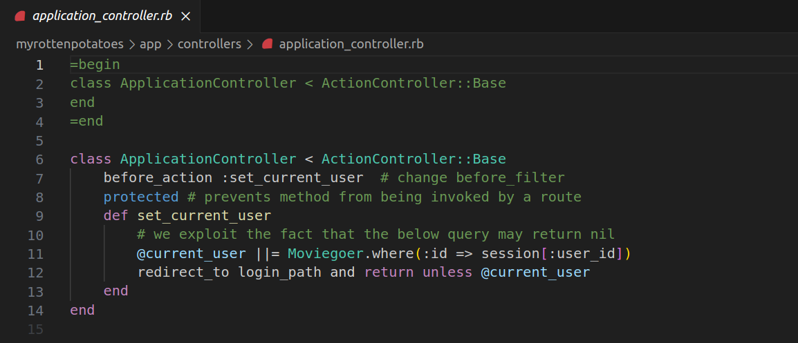

# Rails-Avanzado

## Sección 0: Introducción y Errores Iniciales

### Descripción Inicial:

El código proporcionado inicialmente tiene algunos errores en la lógica del proceso del uso de frameworks y presenta casi todos los tópicos avanzados en clase.

### Errores Iniciales:

Los primeros errores se encuentran en el archivo `app/controllers/application_controller.rb`, donde llamamos a un método de la clase `Moviegoer`, la cual no existe.
Inicio del error:

!
Para corregir esto, cambiaremos la referencia a la clase `Movie`.
  
Luego de cambiar por `Movie`:

Vemos que el error ha cambiado, ahora enfrentamos un error de sintaxis. Este problema se encuentra en la carpeta `app/models`. 


Aquí, debemos quitar los comentarios y ejecutar nuevamente el servidor.


Ahora, el error ha sido corregido. Podemos visualizar las películas y alguna información adicional. Además, ahora podemos agregar nuevas películas.

## Sección 1: Vistas parciales, validaciones y filtros

### Vistas Parciales:

Una vista parcial es el nombre de Rails para una parte reutilizable de una vista. Cuando debe aparecer contenido similar en diferentes vistas.

Según la actividad, nos sugiere , colocar ese contenido en una parte e “incluirlo” en archivos separados ayuda a DRY la repetición.

Creamos el archivo `_movie.html.erb` en el directorio `app/views` e incluimos este fragmento de codigo, que actuara como una vsta parcial.

``` html
<div class="row">
    <div class="col-8"> <%= link_to movie.title, movie_path(movie) %> </div>
    <div class="col-2"> <%= movie.rating %> </div>
    <div class="col-2"> <%= movie.release_date.strftime('%F') %> </div>
</div>
``` 

Actualizamos la línea `<%= render partial: 'movie', collection: @movies %>` del archivo `index.html.haml ` para que coincida con la nueva ubicación.

``` html
<!--  ...other code from index.html.erb here... -->
<div class="row bg-dark text-white">
    <div class="col-6 text-center">Title and More Info</div>
    <div class="col-2 text-center">Rating</div>
    <div class="col-4 text-center">Release Date</div>
</div>
<%= render partial: 'movie', collection: @movies %>
``` 

También cambiaremos el formato de html.haml a html.erb del archivo anteriormente mencionado `index.html.haml `


 

 


### Validaciones de Modelos:

Agrega el código de validación al modelo `Movie` que se proporciona. Verifica los resultados en la consola utilizando el código de ejemplo proporcionado.

### Controlador de Películas (`MoviesController`):

Analiza y entiende el código del controlador proporcionado. Comprende cómo se manejan las acciones `new`, `create`, `edit`, `update`, y `destroy`.

### Canonicalización de Campos del Modelo:

Agrega el método `capitalize_title` al modelo `Movie` para capitalizar el título antes de guardarlo. Verifica los resultados en la consola con el código de ejemplo proporcionado.

### Filtro del Controlador:

Analiza el código del filtro en `ApplicationController`. Entiende cómo se utiliza el filtro `before_filter` para asegurar que un usuario esté autenticado. Comprueba el resultado ejecutando el código proporcionado en la consola.

## Sección 2: SSO y Autenticación a través de Terceros

### Configuración Inicial:

Ejecuta el comando para generar el modelo `Moviegoer` y la migración. Modifica el archivo `app/models/moviegoer.rb` con el código proporcionado.

### OmniAuth y Configuración:

Añade las rutas y controladores necesarios para OmniAuth en `config/routes.rb` y `app/controllers/sessions_controller.rb`. Reemplaza `API_KEY` y `API_SECRET` con las claves reales de Twitter en `config/initializers/omniauth.rb`.

### Seguridad y Preguntas:

Analiza la pregunta sobre la seguridad y comprende la posible vulnerabilidad. Proporciona una respuesta sobre cómo evitar la vulnerabilidad.

## Sección 3: Asociaciones y Claves Foráneas

### Migración y Modelo de Reviews:

Ejecuta el comando para generar la migración de la tabla `Reviews`. Completa la migración en `db/migrate/*_create_reviews.rb`. Crea el modelo `Review` en `app/models/review.rb`.

### Asociaciones Directas:

Agrega la línea `has_many :reviews` a las clases `Movie` y `Moviegoer`. Comprende cómo se utilizan las asociaciones directas en el código proporcionado.

## Sección 4: Asociaciones Indirectas

### Migración de Reviews (Repetida):

Ejecuta el comando para generar la migración de la tabla `Reviews`. Completa la migración de nuevo.

### Asociaciones Indirectas y Consultas SQL:

Comprende cómo se utiliza la opción `:through` en `has_many` para representar una asociación indirecta. Entiende la consulta SQL proporcionada.

### Validaciones y Save con Asociaciones:

Agrega las validaciones al modelo `Review` que se proporcionan. Comprueba el comportamiento de `save` y `save!` en objetos con asociaciones.

### Opciones Adicionales en Asociaciones:

Analiza la información sobre opciones adicionales en los métodos de asociaciones.

## Sección 5: Conclusión y Organización del Informe

### Conclusión:

Recapitula los puntos clave y aprendizajes de cada sección.

### Organización del Informe:

Escribe un informe en formato Ruby on Rails avanzado, organizando la información de manera clara y concisa. Incluye ejemplos y resultados relevantes de la consola donde sea necesario. Presenta el informe en un repositorio llamado `Rails-Avanzado`.

